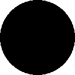

# [](#header-1)Background Story

In Computer Vision or Image Analysis, it is useful to extract the feature of an image which characterize its representation. One notable method is Histogram of Oriented Gradient. Of course the best way to learn it is to read the paper ourself:

> Dalal, Navneet, and Bill Triggs. "Histograms of oriented gradients for human detection." Computer Vision and Pattern Recognition, 2005. CVPR 2005. IEEE Computer Society Conference on. Vol. 1. IEEE, 2005.

Here I would like to simplify the explanation by showing how this method works as shown in the following table

| Image        | HOG Representation (feature dim: 8)          |
|:-------------|:------------------|
|  | [255.99998, 0, 0, 0, 0, 0, 0, 0] |
|  | [0, 0, 0, 0, 255.99998, 0, 0, 0]   |
|  | [0, 0, 256.5, 0, 0, 0, 0.50195307, 0]     |
|  | [0, 0, 0.50196081, 0, 0, 0, 256.50388, 0] |
|  | [73.360161, 101.03394, 73.010605, 101.03346, 73.333313, 101.19398, 72.808472, 101.17259] |
|  | [73.348228, 101.15427, 72.953636, 101.15828, 73.343178, 101.17075, 72.95192, 101.15411] |
|  | [2.9128377, 353.34573, 2.6467891, 0.16636823, 0.93146539, 0.16413036, 0.69803721, 0.15530819] |
|  | [2.9991059, 0.076219894, 0.38040885, 0.17154631, 0.49668261, 0.088716142, 2.8825543, 352.45847] |
|  | [0.93146431, 0.16637088, 2.6467803, 353.3457, 2.9128444, 0.15530944, 0.69803631, 0.16413297] |
|  | [0.4967041, 0.17154786, 0.38039207, 0.076218724, 3.0039086, 352.4584, 2.8777828, 0.088714607] |

In image analysis, it's practically more effective to extract HOG feature in image patch with size 8x8 pixels for example. So, for a 80x80 pixels image, 10x10 blocks of patch are obtained. If we use HOG feature of 8 columns, the feature vector length is 10x10x8 = 800.  

# [](#header-1)How The Code Works


# [](#header-1)Usage


---
layout: default
---

Text can be **bold**, _italic_, or ~~strikethrough~~.

[Link to another page](another-page).

There should be whitespace between paragraphs.

There should be whitespace between paragraphs. We recommend including a README, or a file with information about your project.

# [](#header-1)Header 1

This is a normal paragraph following a header. GitHub is a code hosting platform for version control and collaboration. It lets you and others work together on projects from anywhere.

## [](#header-2)Header 2

> This is a blockquote following a header.
>
> When something is important enough, you do it even if the odds are not in your favor.

### [](#header-3)Header 3

```js
// Javascript code with syntax highlighting.
var fun = function lang(l) {
  dateformat.i18n = require('./lang/' + l)
  return true;
}
```

```ruby
# Ruby code with syntax highlighting
GitHubPages::Dependencies.gems.each do |gem, version|
  s.add_dependency(gem, "= #{version}")
end
```

#### [](#header-4)Header 4

*   This is an unordered list following a header.
*   This is an unordered list following a header.
*   This is an unordered list following a header.

##### [](#header-5)Header 5

1.  This is an ordered list following a header.
2.  This is an ordered list following a header.
3.  This is an ordered list following a header.

###### [](#header-6)Header 6

| head1        | head two          | three |
|:-------------|:------------------|:------|
| ok           | good swedish fish | nice  |
| out of stock | good and plenty   | nice  |
| ok           | good `oreos`      | hmm   |
| ok           | good `zoute` drop | yumm  |

### There's a horizontal rule below this.

* * *

### Here is an unordered list:

*   Item foo
*   Item bar
*   Item baz
*   Item zip

### And an ordered list:

1.  Item one
1.  Item two
1.  Item three
1.  Item four

### And a nested list:

- level 1 item
  - level 2 item
  - level 2 item
    - level 3 item
    - level 3 item
- level 1 item
  - level 2 item
  - level 2 item
  - level 2 item
- level 1 item
  - level 2 item
  - level 2 item
- level 1 item

### Small image


### Large image


### Definition lists can be used with HTML syntax.

<dl>
<dt>Name</dt>
<dd>Godzilla</dd>
<dt>Born</dt>
<dd>1952</dd>
<dt>Birthplace</dt>
<dd>Japan</dd>
<dt>Color</dt>
<dd>Green</dd>
</dl>

```
Long, single-line code blocks should not wrap. They should horizontally scroll if they are too long. This line should be long enough to demonstrate this.
```

```
The final element.
```

