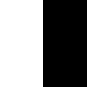
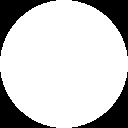
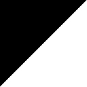
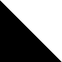
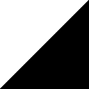

# [](#header-1)Background Story

In Computer Vision or Image Analysis, it is useful to extract the feature of an image which characterize its representation. One notable method is Histogram of Oriented Gradient. Of course the best way to learn it is to read the paper ourself:

> Dalal, Navneet, and Bill Triggs. "Histograms of oriented gradients for human detection." Computer Vision and Pattern Recognition, 2005. CVPR 2005. IEEE Computer Society Conference on. Vol. 1. IEEE, 2005.

Here I would like to simplify the explanation by showing how this method works as shown in the following table

| Image        | HOG Representation (feature dim: 8)          |
|:-------------|:------------------|
|  | ```[255.99998, 0, 0, 0, 0, 0, 0, 0]``` |
|  | ```[0, 0, 0, 0, 255.99998, 0, 0, 0]```   |
|  | ```[0, 0, 256.5, 0, 0, 0, 0.50195307, 0]```     |
|  | ```[0, 0, 0.50196081, 0, 0, 0, 256.50388, 0]``` |
|  | ```[73.360161, 101.03394, 73.010605, 101.03346, 73.333313, 101.19398, 72.808472, 101.17259]``` |
|  | ```[73.348228, 101.15427, 72.953636, 101.15828, 73.343178, 101.17075, 72.95192, 101.15411]``` |
|  | ```[2.9128377, 353.34573, 2.6467891, 0.16636823, 0.93146539, 0.16413036, 0.69803721, 0.15530819]``` |
|  | ```[2.9991059, 0.076219894, 0.38040885, 0.17154631, 0.49668261, 0.088716142, 2.8825543, 352.45847]``` |
|  | ```[0.93146431, 0.16637088, 2.6467803, 353.3457, 2.9128444, 0.15530944, 0.69803631, 0.16413297]``` |
|  | ```[0.4967041, 0.17154786, 0.38039207, 0.076218724, 3.0039086, 352.4584, 2.8777828, 0.088714607]``` |

There are numerous tutorial to learn this method. I don't want to discuss in detail but let me give short explanation.

We generated HOG feature with length of 8. Each column represent the cumulative value of magnitude for a given angle. So, if we have 8 dimension, each will represent 0, 45, 90, 135, 180, 225, 270, and 315 respectively. As an example, the image left.jpg has strong magnitude with directed to the right (0 degrees angle) and the image down.jpg has strong magnitude towards down direction (270 degrees angle). 

In image analysis, it's practically more effective to extract HOG feature in image patch with size 8x8 pixels for example. So, for a 80x80 pixels image, 10x10 blocks of patch are obtained. If we use HOG feature of 8 columns, the feature vector length is 10x10x8 = 800.  

# [](#header-1)How The Code Works

To be added.

```cpp

/// function to compute angle and magnitude image
/// thanks to 
/// http://www.learnopencv.com/histogram-of-oriented-gradients/
/// Dalal, Navneet, and Bill Triggs. "Histograms of oriented gradients for human detection." Computer Vision and Pattern Recognition, 2005. CVPR 2005. IEEE Computer Society Conference on. Vol. 1. IEEE, 2005.
void computeMagAngle(InputArray src, OutputArray mag, OutputArray ang)
{
	Mat img = src.getMat();
	img.convertTo(img, CV_32F, 1 / 255.0);

	/// calculate gradients using sobel
	Mat gx, gy;
	Sobel(img, gx, CV_32F, 1, 0, 1);
	Sobel(img, gy, CV_32F, 0, 1, 1);

	/// Calculate gradient magnitude and direction
	Mat magnitude, angle;
	cartToPolar(gx, gy, magnitude, angle, 1);

	mag.assign(magnitude);
	ang.assign(angle);
}


/// function to compute histogram of oriented gradients feature
/// thanks to 
/// http://www.learnopencv.com/histogram-of-oriented-gradients/
/// Dalal, Navneet, and Bill Triggs. "Histograms of oriented gradients for human detection." Computer Vision and Pattern Recognition, 2005. CVPR 2005. IEEE Computer Society Conference on. Vol. 1. IEEE, 2005.
void computeHOG(InputArray mag, InputArray ang, OutputArray dst, int dims, bool isWeighted = true)
{
	/// init input values
	Mat magMat = mag.getMat();
	Mat angMat = ang.getMat();

	/// validate magnitude and angle dimensions
	if (magMat.rows != angMat.rows || magMat.cols != angMat.cols) {
		return;
	}

	/// get row and col dimensions
	int rows = magMat.rows;
	int cols = magMat.cols;

	/// set up the expected feature dimension, and  
	/// compute the histogram bin length (arc degree) 
	int featureDim = dims;
	float circleDegree = 360.0;
	float binLength = circleDegree / (float)featureDim;
	float halfBin = binLength / 2;

	/// set up the output feature vector
	/// upper limit and median for each bin
	Mat featureVec(1, featureDim, CV_32F);
	featureVec = 0.0;
	vector<float> uplimits(featureDim);
	vector<float> medbins(featureDim);

	for (int i = 0; i < featureDim; i++) {
		uplimits[i] = (2 * i + 1) * halfBin;
		medbins[i] = i * binLength;

		//cout << "(" << medbins[i] << ") ";
		//cout << uplimits[i] << " ";
	}
	//cout << endl;

	/// begin calculate the feature vector
	for (int i = 0; i < rows; i++)
	{
		for (int j = 0; j < cols; j++)
		{
			/// get the value of angle and magnitude for 
			/// the current index (i,j)
			float angleVal = angMat.at<float>(i, j);
			float magnitudeVal = magMat.at<float>(i, j);

			/// (this is used to calculate weights)
			float dif = 0.0; /// dfference between the angle and the bin value 
			float prop = 0.0; /// proportion for the value of the current bin 

							  /// value to add for the histogram bin of interest
			float valueToAdd = 0.0;
			/// value to add for the neighbour of histogram bin of interest
			float sideValueToAdd = 0.0;
			/// index for the bin of interest and the neighbour
			int valueIdx = 0;
			int sideIdx = 0;

			/// the first bin (zeroth index) is a little bit tricky 
			/// because its value ranges between below 360 degree and higher 0 degree
			/// we need something more intelligent approach than this
			if (angleVal <= uplimits[0] || angleVal >= uplimits[featureDim - 1]) {

				if (!isWeighted) {
					featureVec.at<float>(0, 0) += magnitudeVal;
				}
				else {
					if (angleVal >= medbins[0] && angleVal <= uplimits[0]) {
						dif = abs(angleVal - medbins[0]);

						valueIdx = 0;
						sideIdx = 1;
					}
					else {
						dif = abs(angleVal - circleDegree);

						valueIdx = 0;
						sideIdx = featureDim - 1;
					}
				}

			}
			/// this is for the second until the last bin
			else {
				for (int k = 0; k < featureDim - 1; k++)
				{
					if (angleVal >= uplimits[k] && angleVal < uplimits[k + 1]) {
						if (!isWeighted) {
							featureVec.at<float>(0, k + 1) += magnitudeVal;
						}
						else {
							dif = abs(angleVal - medbins[k + 1]);
							valueIdx = k + 1;

							if (angleVal >= medbins[k + 1]) {
								sideIdx = (k + 1 == featureDim - 1) ? 0 : k + 2;
							}
							else {
								sideIdx = k;
							}
						}

						break;
					}
				}
			}

			/// add the value proportionally depends of 
			/// how close the angle to the median limits
			if (isWeighted) {
				prop = (binLength - dif) / binLength;
				valueToAdd = prop * magnitudeVal;
				sideValueToAdd = (1.00 - prop) * magnitudeVal;
				featureVec.at<float>(0, valueIdx) += valueToAdd;
				featureVec.at<float>(0, sideIdx) += sideValueToAdd;
			}

			//cout << endl;
			//cout << "-angleVal " << angleVal << " -valueIdx " << valueIdx << " -sideIdx " << sideIdx << endl;
			//cout << "-binLength " << binLength << " -dif " << dif << " -prop " << prop << endl;
			//cout << "binLength - dif " << binLength - dif << " (binLength - dif) / binLength " << (binLength - dif) / binLength << endl;
			//cout << "-> " << featureVec << endl;
		}
	}

	dst.assign(featureVec);
}

```

The result returned by the function is not normalized. You may want to normalize using opencv ```normalize``` function as conveyed by literatures.


# [](#header-1)Usage

To be added.

Test No 1

```cpp
int main(int argc, char** argv)
{
	float dummyMag[8] = {1,1,1,1,1,1,1,1};

	float dummyAng[8] = {0,18,90,99,351,270,144,180};

	Mat mag = Mat(1, 8, CV_32F, dummyMag);
	Mat ang = Mat(1, 8, CV_32F, dummyAng);

	Mat wHogFeature;
	Mat uHogFeature;
	computeHOG(mag, ang, wHogFeature, 8, true);
	computeHOG(mag, ang, uHogFeature, 8, false);

	cout << endl << endl;
	cout << "Magnitude: " << mag << endl;
	cout << "Angle: " << ang << endl;
	cout << "Weighted HOG feature: " << wHogFeature << endl;
	cout << "Unweighted HOG feature: " << uHogFeature << endl;

	std::cout << "done!" << endl;

	std::cin.get();

	return 0;
}
```

Test No 2

```cpp
int main(int argc, char** argv)
{
	vector<String> files = {"left.jpg", "right.jpg", "up.jpg", "down.jpg", 
		"roundin.jpg", "roundout.jpg",
		"leftup.jpg", "leftdown.jpg", "rightup.jpg", "rightdown.jpg"
	};

	for (int i = 0; i < files.size(); i++)
	{
		Mat img = imread(files[i], IMREAD_GRAYSCALE);
		cout << files[i] << endl;

		Mat hogFeature, mag, ang;
		computeMagAngle(img, mag, ang);
		computeHOG(mag, ang, hogFeature, 8, true);

		cout << hogFeature << endl << endl;
	}

	cin.get();

	return 0;
}
```
